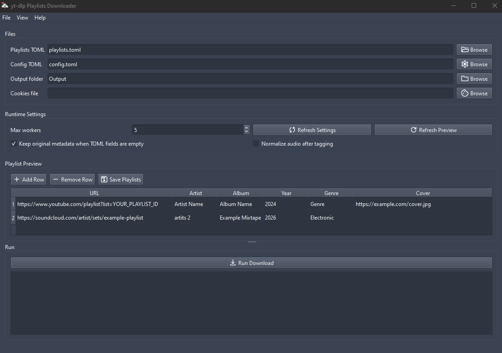

# yt-dlp-playlists-downloader

`yt-dlp-playlists-downloader` is a Python app that downloads playlist tracks with `yt-dlp`, organizes them into artist and album folders, and applies ID3 metadata from TOML files.

It works well for YouTube and SoundCloud playlists because media extraction is handled by `yt-dlp`.

## Preview



## Who Is This For

People who want to download multiple playlists and tag them cleanly for use in music players or media servers.

## Features

- Downloads YouTube and SoundCloud playlist entries from a TOML file as MP3
- Provides both GUI and CLI modes
- Organizes output under `Output/<Artist>/<Album - Artist>/` by default
- Applies artist, album, year, genre, title, and track number metadata
- Embeds a custom cover image or preserves the original downloaded thumbnail
- Can normalize audio with FFmpeg
- Processes multiple playlists in parallel

## Requirements

- Python 3.11 or newer
- `yt-dlp`
- FFmpeg

`yt-dlp` and FFmpeg must both be available in your `PATH`.

Python package metadata and dependencies are defined in `pyproject.toml`.

## Installation

1. Clone the repository.
2. Install the app:

```bash
python -m pip install .
```

3. Install `yt-dlp` if it is not already available:

```bash
python -m pip install -U "yt-dlp[default]"
```

4. Make sure FFmpeg is installed and available in your `PATH`.

For local development, install in editable mode instead:

```bash
python -m pip install -e .
```

`requirements.txt` also installs the project in editable mode for development workflows.

## Data Files

Two TOML files are used:

- `playlists.toml`: playlist entries and metadata
- `config.toml`: persistent runtime defaults

CLI flags and GUI controls can override values from `config.toml` when needed.

## `playlists.toml` Format

Each playlist is defined as a `[[playlists]]` entry.

Example:

```toml
[[playlists]]
url = "https://www.youtube.com/playlist?list=YOUR_PLAYLIST_ID"
artist = "Artist Name"
album = "Album Name"
year = 2024
genre = "Genre"
cover_url = "https://example.com/cover.jpg"
```

Supported playlist fields:

- `url`: required
- `artist`: optional
- `album`: optional
- `year`: optional
- `genre`: optional
- `cover_url`: optional

Optional fields may be omitted entirely.

## `config.toml` Format

`config.toml` stores persistent defaults for runtime behavior.

Example:

```toml
[settings]
output_dir = "Output"
max_workers = 5
keep_original_metadata = true
enable_normalization = false

# Optional:
# cookies_file = "youtube_cookies.txt"
```

Supported settings:

- `output_dir`
- `max_workers`
- `keep_original_metadata`
- `enable_normalization`
- `cookies_file`

## Config Precedence

Settings are resolved in this order:

1. CLI flags or GUI controls
2. `config.toml`
3. Built-in defaults

## Cover Image Behavior

The `cover_url` field can contain:

- A remote image URL such as `http://...` or `https://...`
- A local file path to an image

If a custom cover is provided, the app converts it to JPEG, saves it in the album folder, copies it to `Output/Covers/` by default, and embeds it into each MP3.

If no custom cover is provided, the app asks `yt-dlp` to embed the source thumbnail when possible.

## Usage

Run with the default files in the current directory:

```bash
ytdlp-playlists
```

Show the built-in CLI help:

```bash
ytdlp-playlists --help
```

Run the GUI:

```bash
ytdlp-playlists-gui
```

When running directly from a repository checkout, `python main.py` and `python -m gui.app` are also available as quick compatibility entry points.

## CLI Options

- `playlists_file`: Optional path to the playlists TOML file. Default: `playlists.toml`
- `--config`: Optional path to a config TOML file. If omitted, the app uses `config.toml` when present.
- `--cookies`: Optional cookies file passed to `yt-dlp`
- `--output-dir`: Base folder for downloads and the shared `Covers/` directory. Default: `Output`
- `--max-workers`: Number of playlists processed in parallel. Default: `5`
- `--keep-original-metadata`: `true` or `false`. When playlist metadata fields are missing, keep existing tags if `true`, or clear them if `false`. Default: `true`
- `--enable-normalization`: `true` or `false`. Enables FFmpeg loudness normalization after download and tagging. Default: `false`
- `--log-file`: Optional path for the run log. If omitted, a timestamped log is created under `logs/`.

## Output Structure

Downloaded files are stored like this:

```text
Output/
  Covers/
  Artist Name/
    Album Name - Artist Name/
      Song Title.mp3
      Artist Name-Album Name-cover.jpg
```

## License

This project is licensed under the GNU General Public License v3.0. See [LICENSE](LICENSE) for the full license text.
